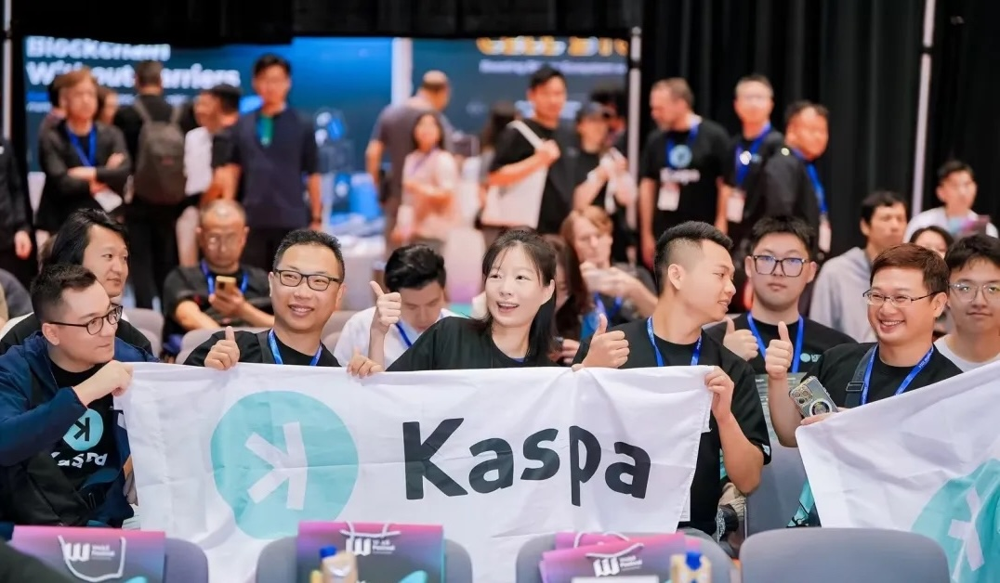

# Kaspa Builders

  

Welcome to the Kaspa Builders community repository! This is where we organise and share resources to help grow the Kaspa ecosystem.

## About

Kaspa Builders are people who help grow Kaspa—through whatever they're best at. Whether you're building content, writing code, organising events, answering questions, or helping someone install their first wallet, you're contributing.

You don't need to be a developer. If you care enough to help, you already belong here.

## Repository Structure

- 📁 `docs/` - Core documentation and guides
- 📁 `resources/` - Educational materials, templates, and tools
  - 📁 `battlecards/` - Kaspa battle card translations and template ([Translation Status](resources/battlecards/translation-status.md))
- 📁 `community/` - Community ethos and processes
- 📁 `events/` - Event planning and resources
- 📁 `translations/` - General content translations (documentation, guides, etc.)
- 📁 `archive/` - Historical content and deprecated materials

## Getting Started

1. Read our [Vision Statement](docs/vision-statement.md)
2. Check out our [Ethos](community/ethos.md)
3. Find ways to contribute in our [Get Involved](docs/get-involved.md) guide

## Contributing

This is an open repository. Feel free to:
- Suggest improvements through issues
- Submit pull requests with new content
- Share your work and reference "Kaspa Builders"

## Monthly Focus

Each month, we focus on a theme—like mining outreach or onboarding guides—and invite the community to contribute content or tools around that theme. Check our [Monthly Focus](docs/monthly-focus.md) for current and past themes. 